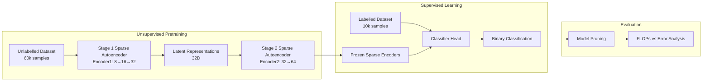
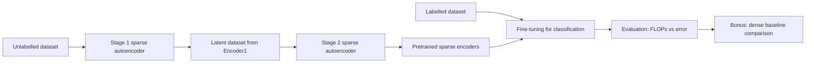
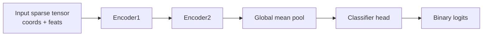
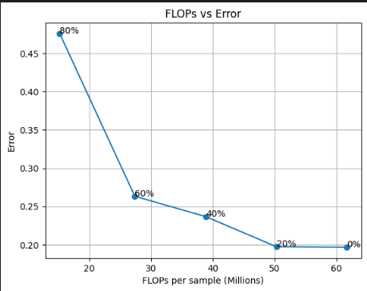
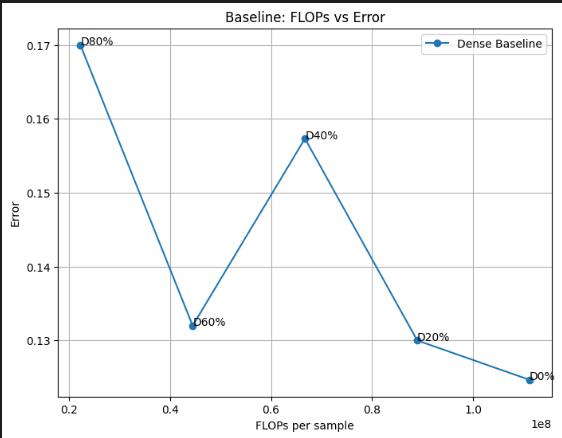

# Sparse Convolutional Autoencoder for Event Classification

[](https://www.python.org/downloads/)  
[](https://opensource.org/licenses/MIT)

## Project Architecture



This repository implements a hierarchical sparse learning pipeline for particle-physics event classification. The project uses rulebook-based sparse convolutions, two stages of unsupervised pretraining, classifier fine-tuning on labelled data, and pruning-based FLOPs–error analysis. A dense CNN baseline is also included for comparison.

---

## Highlights

- **Two-stage sparse autoencoder pretraining** on the unlabelled dataset
- **Transfer learning** from pretrained sparse encoders to binary classification
- **Rulebook-based sparse convolution** operating only on active spatial locations
- **Custom FLOPs estimation** for sparse inference
- **Pruning experiments** to study the compute–accuracy trade-off
- **Dense CNN baseline** for comparison

---

## Pipeline Overview



The workflow is sequential: learn sparse representations on unlabelled data, reuse the pretrained encoders for classification, then analyze the effect of pruning on computational cost and error.

---

## Repository Structure

```
end2end_sparse/
├── Data inspection and stage 1 ae.ipynb
├── stage2_autoencoder.ipynb
├── fine tuning.ipynb
├── evaluation.ipynb
├── Bonus task.ipynb
├── models_arch.py
├── utility.py
├── data/
│   ├── Dataset_Specific_Unlabelled.h5
│   ├── Dataset_Specific_labelled.h5
│   └── latent.h5
└── checkpoints or .pth files
```

### Notebook Roles

- **Data inspection and stage 1 ae.ipynb**: Inspect datasets, analyze sparsity, and train the first sparse autoencoder.
- **stage2_autoencoder.ipynb**: Train the second sparse autoencoder on latent outputs produced by Stage 1.
- **fine tuning.ipynb**: Train the classifier head using the pretrained encoders.
- **evaluation.ipynb**: Compute FLOPs estimates, perform pruning, and generate the sparse model efficiency curves.
- **Bonus task.ipynb**: Train and evaluate a dense CNN baseline and compare it to the sparse model.

---

## Data Representation

Each event is stored as a jet tensor:

**(125, 125, 8)**

This dense tensor can be converted into sparse form:

- **coords (N,3)** containing [batch_index, y, x]
- **feats (N,8)** containing feature vectors

Only non-zero spatial locations are stored, reducing the number of operations needed for convolution.

---

## Sparse Architecture



### Encoder Stack

The sparse encoder hierarchy follows the channel progression:

**8 → 16 → 32 → 64**

- **Encoder1**: Extracts sparse features from the original jet tensor
- **Encoder2**: Refines the latent sparse representation
- **Global mean pooling**: Converts the sparse feature map to a fixed vector
- **Classifier head**: Predicts binary logits

---

## FLOPs Computation

Standard dense-model profilers do not accurately capture sparse computation because the number of operations depends on the active sparse coordinates.

Sparse FLOPs are estimated using:

**FLOPs ≈ 2 × number_of_pairs × Cin × Cout × weight_density**

summed across sparse convolution and linear layers.

These values represent effective computational cost, not direct hardware runtime.

---

## Results

### Sparse Model FLOPs vs Error


This curve shows the trade-off between pruning level and model error.

- Lower pruning levels maintain accuracy while slightly reducing FLOPs.
- More aggressive pruning reduces FLOPs further but increases error.

### Dense Baseline FLOPs vs Error

The dense CNN baseline achieves lower classification error in the unpruned case but requires higher computational cost.

---

## Quick Start

### Installation

```bash
pip install torch h5py numpy matplotlib ptflops
```

### Run the Notebooks in Order

1. Data inspection and stage 1 ae.ipynb
2. stage2_autoencoder.ipynb
3. fine tuning.ipynb
4. evaluation.ipynb
5. Bonus task.ipynb

---

## Key Takeaways

- Sparse neural networks are suitable when the input data is spatially sparse
- Unsupervised pretraining produces useful sparse feature representations
- Pruning allows analysis of the compute–accuracy trade-off
- Sparse models improve computational efficiency, while dense baselines may achieve slightly higher accuracy

---

## Notes

- Sparse FLOPs values are estimated using rulebook statistics and depend on dataset sparsity
- Results may vary slightly depending on data splits and pruning configuration
